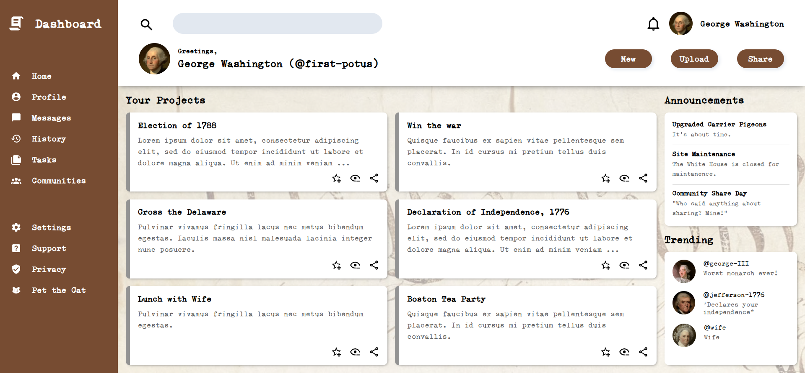
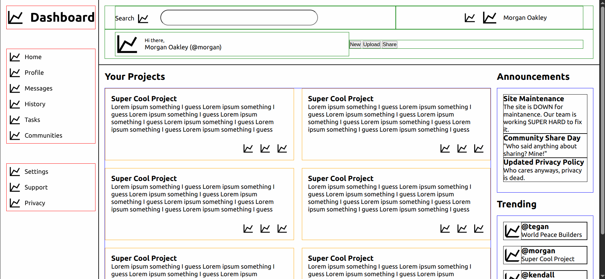

# admin-dashboard

An administrative dashboard created with HTML & CSS. 

## Reflection

### Major concepts used / exercised
- grid layout
- planning out high-level & low-level structure and create wireframe
- using relative units & functions (fr, rem, minmax) to create responsive text sizes & grid layout 
- practicing various css properties: shadows, overflow, background, min/max sizing, svg editing
- using custom css properties (var) to create uniform styles across the page
- using a self-hosted font
- tested in Firefox and remedied differences between it and Chrome

This project provided me valuable experience in planning out a complex webpage — coding a wireframe in HTML with basic styling and filling in the more low-level details. Pictured is an early draft I created.

### Constraints
- used grid for nearly every element per project specs; to get practice with it I presume. some would probably be better with flex
- forewent semantically correct HTML: will be learned later
- not fully accessible: will be learned later
- not fully responsive: will be learned later
- (Odin Project-specific) didn't implement styled radio buttons or select form elements in this course. but maybe it's enough to know they exist for now and having followed along with the tutorials; and I don't think there'll be a shortage of opportunities to practice html/css even in the upcoming Javascript course, haha. 

### Did well / Room for improvement

 <strong>I did well with:</strong> In the previous Sign-Up Form project, I wanted to plan better and lay out properties needed, and I did just this project. I created a wireframe that seamlessly allowed me to go into low-level styling when I was ready; noted padding/gap sizes, alignments, & potential text overflows; enumerated all my font sizes before implementing them; and noted which elements should be dependent on font size. 
 
 <strong>To improve on:</strong> While I was able to plan the layout better, I can still improve by paying more attention to where the following properties arise so I can pre-emptively define classes & custom properties to connect any commonalities before putting them in the wireframe: icon/image sizes, subgrids, gaps between the smaller elements, and alignments. This additional planning might help to write neat code faster once you get good at it, and preclude future refactoring of the code to be less spaghetti.  

### Looking at other people's projects
What I gleaned from looking at other people's projects: there are different ways to structure the grid; different normalization styles to apply with text; ways to improve coding speed; and all the different beautiful styles that are possible. 

- [maru](https://github.com/renegade-404/admin-dashboard): looks like she used some reset properties (maybe from Josh Comeau's): text-wrap, -webkit-font-smoothing, overflow-wrap. used line names to cosntruct the grid. constructed the main-content grid without cells for the headers, which might be better for semantics since they are not disconnected from their purpose like mine is. 
- [htkael](https://github.com/htkael/Admin-Dashboard/commits/main/): he used flex containers in header; just an observation, good to know that's possible. just used keywords for the colors and assigned font sizes as he went (?) which helps save time
- [sh4mblesss](https://github.com/arvingarciabtw/the-odin-project/tree/main/full-stack-javascript/fsj-01-intermediate-html-and-css/07-admin-dashboard): constructed the header using a 2-by-2 grid. interesting! I can do that next time for simplicity, not having to manage two "rows". I shied away from this approach because all four corners had different amount of content from each other, but that can still be solved with a 2-by-2 grid I think. 
- [aroan](https://aroan-v.github.io/Music-Dashboard/): WOW. this looks so nice, so I'm bookmarking it for style inspiration. regarding the layout, looks like a fairly complex grid layout. 

### Moving on to the next course!
Total time spent: 28 hours to finish dashboard. 1:20 hour looking at other people's dashboards. 1:30 hour writing README and my reflection. 

> You’re likely new to writing code, so resist the urge to spend too much time trying to write things perfectly. If you have completed the requirements using the topics introduced in the sections prior to a project, you can consider the project complete. Being a perfectionist is a direct route to burnout and potentially to not finishing the course. [-The Odin Project](https://dev.to/theodinproject/learning-code-f56)

## Credits for assets
- Font by GGBotNet on dafont.com: https://www.dafont.com/x-typewriter.font
- Conversion to woff/woff2 format and at-rule provided by https://transfonter.org/
- Icons by Pictogrammers: https://pictogrammers.com/library/mdi/
- Background image: By Constitutional Convention - U.S. National Archives and Records Administration, Public Domain, https://commons.wikimedia.org/w/index.php?curid=15795309
- George Washington: By Gilbert Stuart - https://www.clarkart.edu/ArtPiece/Detail/George-Washington, Public Domain, https://commons.wikimedia.org/w/index.php?curid=591229
- George III: By Allan Ramsay - vgGv1tsB1URdhg at Google Cultural Institute maximum zoom level, Public Domain, https://commons.wikimedia.org/w/index.php?curid=23604082
- Thomas Jefferson: By Rembrandt Peale - https://www.whitehousehistory.org/galleries/presidential-portraits, Public Domain, https://commons.wikimedia.org/w/index.php?curid=20179140
- Martha Washington: By After Gilbert Stuart - http://armstrong-history.wikispaces.com/Jane+Y.-+I+am+Martha+Washington, Public Domain, https://commons.wikimedia.org/w/index.php?curid=19679156

## Sources of help
These are helpful threads I consulted for help over the course of developing this project. Note that most documentation I looked at is omitted due to how many I look at.
- [Body & root element height](https://stackoverflow.com/questions/6654958/make-body-have-100-of-the-browser-height)
- [MDN usecases of flexbox (didn't use flex but good to know)](https://developer.mozilla.org/en-US/docs/Web/CSS/CSS_flexible_box_layout/Typical_use_cases_of_flexbox)
- [Interactive CSS cheatsheet](https://htmlcheatsheet.com/css/)
- [SVG editor](https://www.svgviewer.dev/)
- [Setting opacity on background image](https://stackoverflow.com/questions/12605908/change-background-image-opacity)
